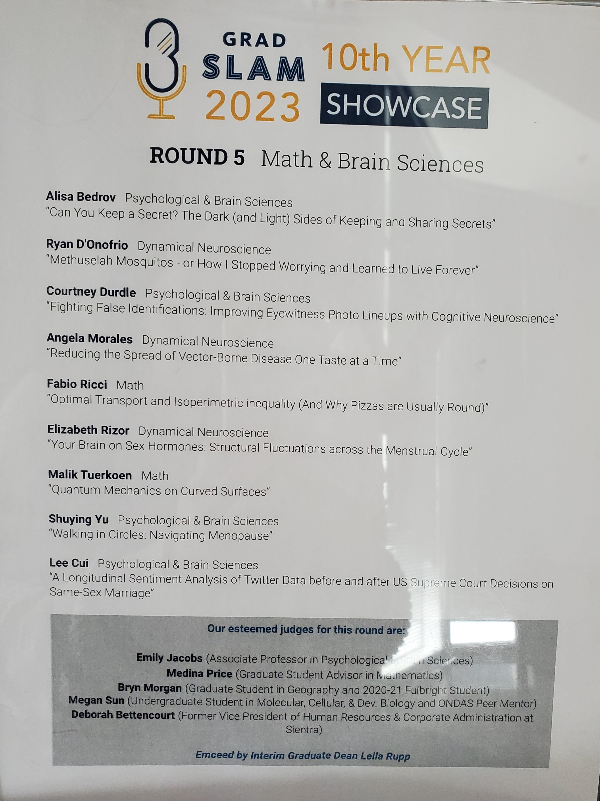
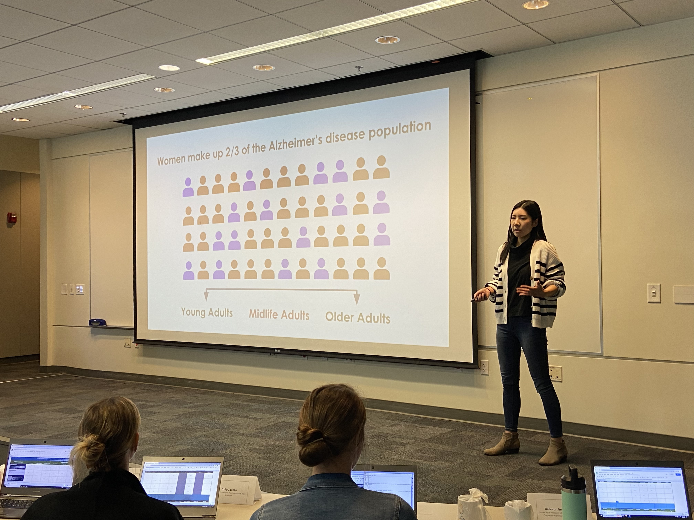
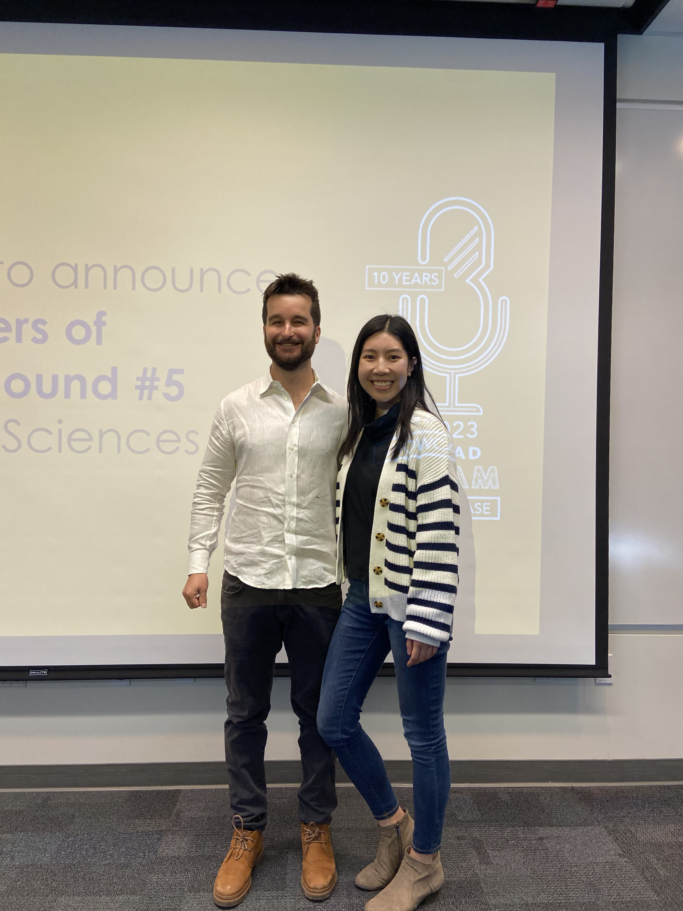
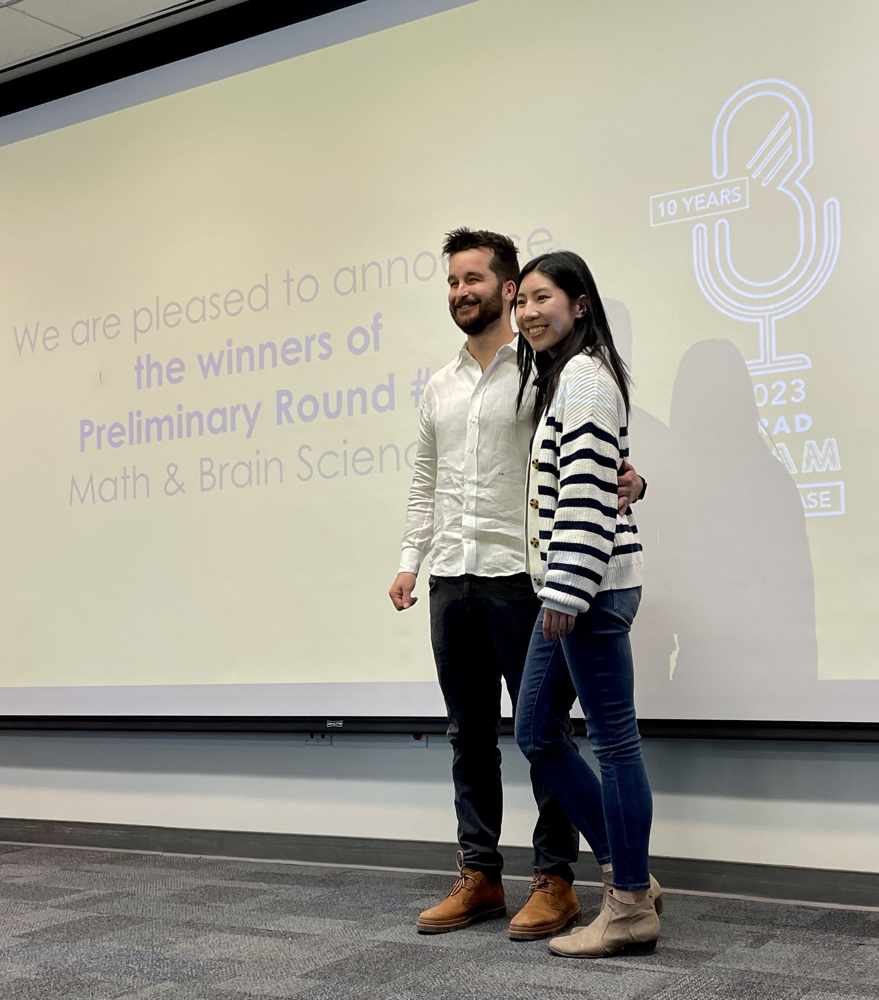

```{r setup, include=FALSE}
knitr::opts_chunk$set(echo = FALSE, warning = FALSE, message = FALSE,
                      fig.align = "center")

#Libraries
library(here)
```


This year was the year that I (finally) had results from my project and also the year that *wasn't* during a pandemic, so I decided to sign up for the [UC Santa Barbara Grad Slam](https://www.gradpost.ucsb.edu/grad-slam) competition 10 days before my department's preliminary round was set to take place. Grad Slam is an annual event that spotlights graduate students' research in 3-minute lightning talks (like mini-TED talks) that are "clear, direct, and engaging to diverse audiences". This tradition started at UC Santa Barbara and 2023 celebrates its 10th year showcase.

I absolutely love it when academics come up with tongue-in-cheek titles for their talks and especially when they are bold enough to use good word play titles in peer-reviewed publications. Since my project and dissertation is about the impact of sex hormones on the brain's navigation circuitry in midlife men and women, I crafted the title *Menopause Makes Women (and Men) Walk in Circles* literally when I was a second year, and secretly hoped that I would one day make use of it. After workshoping it with members in my lab, we came up with an even better and slick title for my Grad Slam talk (and maybe dissertation): *Walking in Circles: Navigation Menopause*.

The hardest part about giving talks is knowing what story you want to tell. It's exponentially more difficult given the time limit of 3 minutes and having to captivate and convince a general audience that your esoteric research topic is important! But it all comes down to three main things: 1) what is the question, 2) what did you do, and 3) why is it (your research) important. Luckily, there wasn't a hard rule against the number of slides we could use this year after Graduate Division decided to [give the 2023 competition a revamp](https://www.gradpost.ucsb.edu/grad-slam/2023), but I still spent about two days writing and editing a script of what I wanted to say with each slide. As I was noodling on crafting the exact words to articulate, I prepared my slides using previous work examples and preliminary data from the lab. I low-key love making figures and slide decks — this includes everything from finding the right color palettes and vector images, to finding the right transitions to use to emphasize the message. Finally, I practiced my enunciation, tone, cadence and timing of my presentation until I had it memorized.

On the day of the competition, I was really excited to learn about my peers' research. I learned about geometry and shapes from the speakers in the Math department, and also learned a little bit about Liz Rizor's research since she also presented about sex hormones in the brain. My advisor, Emily Jacobs, was coincidentally one of the judges on the panel, so naturally she recused herself from judging my and Liz's presentations. But it was great to have her there for moral support! 

They had the communications team come to professional record the talks, which I assume is for future promotional materials and hopefully to share with the graduate students so we can use the videos as a learning guide on how to improve our talks for future presentations. To watch my recorded talk, please visit the [Videos section](https://esswhy.github.io/scientific_communication.html#videos) of my publications and scientific communications tab!




When it was my turn to go, I definitely felt the nerves as I got up on stage. But everything seemed to flow pretty well as soon as I started speaking. There were definitely some hiccups here and there, of course. The audience was sparse, but I think that helped make the talk more intimate and easy to communicate, like you're just talking to some friends who really wanted to ask what you've been up to for the last 5+ years. 



They announced the winners at the end after tallying the scores. Since Emily couldn't judge my talk, they replaced her scores for each section with an average score compiled from the remaining of the judges. Fabio from the Math department won, with his talk about how we can use math to optimize the number of toppings on a pizza. Then they announced me as the runner-up, which was a nice surprise! The winner goes on to compete as a finalist in April and wins \$1000, and the runner-up receives the title and also gets a sweet cash prize of \$500.

 


A week after the competition, Graduate Division shared the anonymous feedback and scores from the judges. Here are mine below:

```{r echo=FALSE, message = FALSE, warning = FALSE, fig.align = "center", fig.pos = "H", out.width = "800px", out.height = "600px"}
knitr::include_graphics("grad_slam_feedback_shuying.pdf")
```

Congratulations to all the presenters for their hard work in the competition! I really enjoyed learning about others' research and I look forward to seeing the final showcase in April.

In summary, I had a lot of fun and I'm glad I did it. It felt good to have friends and colleagues be so supportive and willing to help by providing advice, listening to rehearsals of my talk, and attending in the audience. Even though there were many stressful and discouraging moments in the last 5+ years of grad school, this experience has revived the part of me that wanted to pursue grad school in the first place. The pursuit of knowledge, the intellectually curious peers, the strive to make a difference in the world. I'm relishing in the feelings of hope and optimism so that they can carry me through the next several months towards the finish line!


