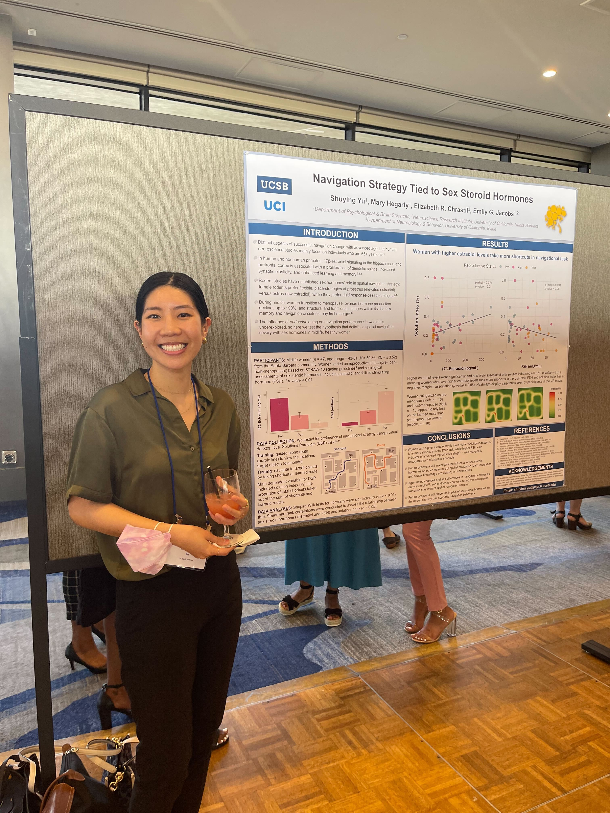
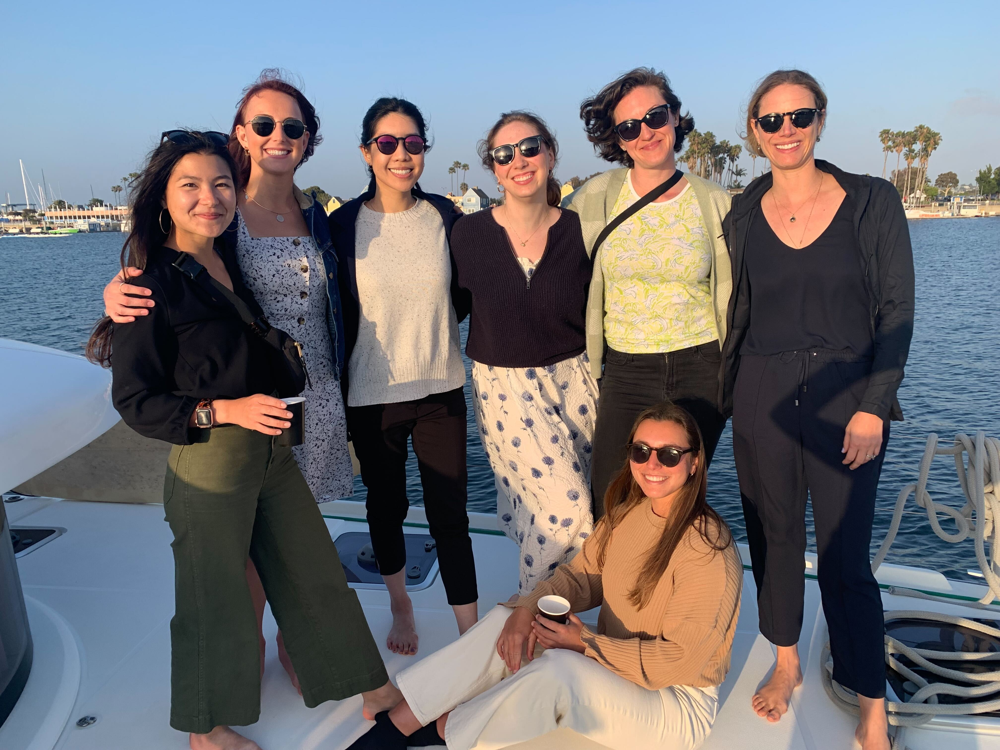

```{r setup, include=FALSE}
knitr::opts_chunk$set(echo = FALSE)

#Libraries
library(here)
```


Last week, I attended the Organization for the Study of Sex Differences (OSSD) Conference at Marina del Rey with my lab. I was supposed to attend back in 2020, but COVID had other plans. It was really exciting to be grounded in an intimate setting of brilliant scientists who advocate for the inclusion of women in science and acknowledge the role that hormones and sex play in facets such as medicine and neuroscience.

I presented a poster which includes research that will be part of the first study of my dissertation! In this poster, I found that preference for spatial navigation strategy (shortcuts or learned routes) is tied to concentrations of sex steroid hormones in midlife women. Women with higher estradiol concentrations were more likely to use shortcuts, and the inverse is marginally true such that women with higher follicle stimulating hormone, which is a characteristic of menopause, was related to taking fewer shortcuts in a dual-solutions maze learning task. This work in humans support previous rodent literature that higher estrogen in females increases more flexible, place-based strategies!




Outside of the conference, I also made time to see the Venice Canals, Venice Beach, and hopped on a boat and sailed around the Marina with my lab to celebrate the end of collecting data for Healthy Aging Study (large fMRI project I worked on for ~5 years that I will use for my dissertation) and for all the lab birthdays!




