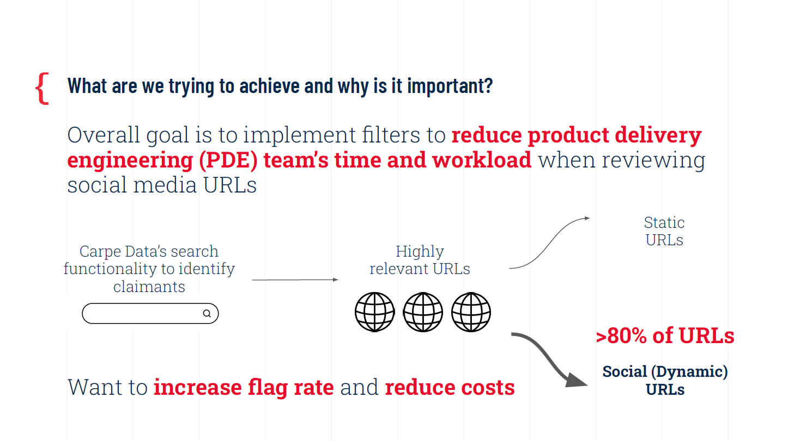
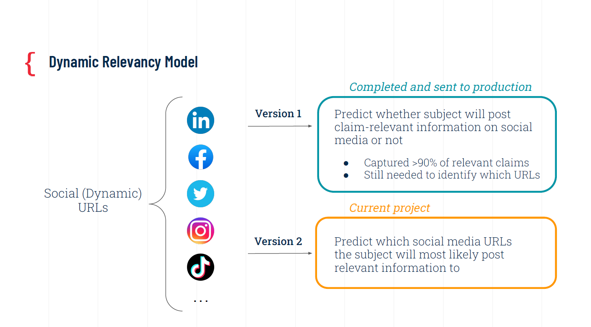
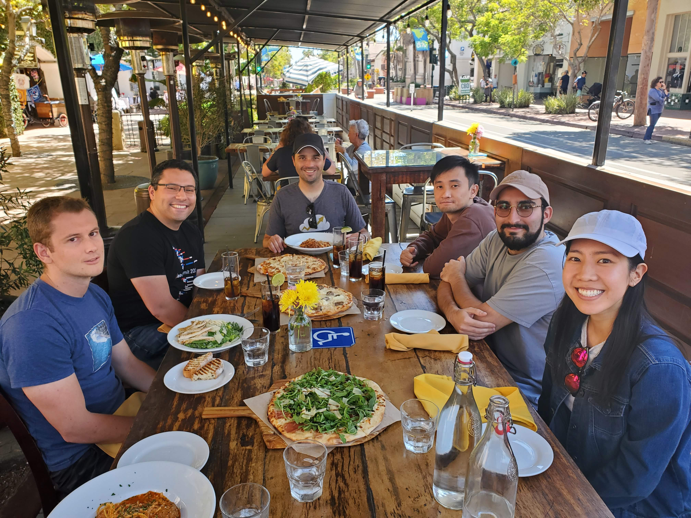

# Introduction

During the summer of 2022 for three months, I did an in-person Data Science internship with [Carpe Data](https://www.carpe.io/) in Santa Barbara, CA. They are an Insurance Tech company that provides data and products for insurance carriers to help detect fraudulent claims and assess risks. 

My project as an independent contributor over the course of 10 weeks was to create an upgraded version of the Dynamic Relevancy Model that my manager had created. 

# Project

## Goals

Carpe Data receives data from insurance carriers and the product delivery engineering (PDE) team uses the company's internal search functionality to filter and identify claimants that are potentially fraudulent. These searches include highly relevant URLs that may contain relevant information in processing claims. These URLs could be split into either static (e.g., pages that do not get updated) or social (e.g., dynamic pages that get regular updates) URLs, with the latter making up >80% of the URLs in the database.

The goal was to create a machine learning model that could help filter for these relevant URLs (mainly the social URLs like LinkedIn, Twitter, Facebook, etc.) to reduce the time and workload of the PDE team, and ultimately save the company money and resources that could be directed elsewhere.

My manager previously worked on the first iteration of the model to predict whether subjects would post claim-relevant information on social media sites or not. Her model helped capture >90% of relevant claims, but it still needed a filter to identify *which* specific URLs were relevant.

Thus for my project, I refined the Dynamic Relevancy Model by using multi-label classification to predict which social media sites the subject will likely most claim-relevant information to.

## Methods

After wrangling the data through AWS and concatenating the variables together from multiple CSV files, I cleaned and explored the data. The top five social media sites among the subjects were LinkedIn, Facebook, Twitter, Instagram, and "other" (anything *not* LinkedIn, Facebook, Twitter, or Instagram). This is how we decided to create the labels; it was based on which social media sites were highly reprepresented in the data. We also created a label called "NaN" for social media sites linked to a subject that had no claim-relevant information whatsoever.

So in total, there were six major domain labels:

1. Facebook
2. Twitter
3. LinkedIn
4. Instagram
5. Other
6. NaN

 

For example, **Subject A** might have a few social media sites where the description from internal feedback (information provided by PDE) stated whether that particular URL contained claim-relevant information or not. In this example, only Instagram and LinkedIn were relevant, so Subject gets a listed label for those two social mediate sites. All the irrelevant sites do not get listed.

**Subject B** could have social media sites such as TikTok, Facebook, and Twitter with relevant information, but because TikTok is not among the four major social labels, it gets categorized as "other" in the listed label.

Finally, it could be the case where a subject's associated social media sites contain no relevant information based on the internal feedback. Thus, **Subject C** receives the "NaN" label. 

The list of labels was transformed to multiple labels or columns using the multi-label binarizer from `sklearn.preprocessing MultilabelBinarizer`. 

During exploratory data analysis, the major social URLs represented over 99% of the social URLs with relevant claim information. After taking into account those with irrelevant claim information (NaN), we see that the training dataset was highly imbalanced. The fill rate for subject data was also low, meaning that there were a lot of missing data.

A list of numeric and categorical features were cleaned, dummy coded, and aggregated to select for the training data in the models. Variables were chosen based on intuition, from previous models, and based on whether there could be multicolinearity between similar variables. Numeric correlation analyses wree conducted using Pearson and Spearman correlations, and categorical correlation analyses were conducted using Cramer's V.

Training data (*n* = ~260k after a 70/30 split) was resampled to adjust for class imblanace since most URLs were NaN, and afterwards missing numeric data were imputed based on the average value of the variable.

## Results

My model pipeline started with using a multi-label random forest classifier from `sklearn.ensemble.RandomForestClassifier`. Hyperparameter tuning and training on many iterations of the model led to one that had overall low recall and precision for the social domain URLs that contained relevant claim information. However, recall and precision scores (~98% and above) were high when the model was identifying which social URLs *did not* contain relevant claim information. Other model metrics (ROC, AUC, F1 score, etc.) were computed for each model.

During the model optimization step, I tuned the threshold criterion with a probability range (0.10-0.90) and recomputed the model metrics based on the best model (Model 2.6). The model using this approach (Model 2.6.2) had a threshold criterion of 0.70 that produced produced high recall and precision (at least 85%) for all URLs with no relevant claim information. 

Another optimization step involved resampling the training data based on labels that were "zero" (had irrelevant claim information) and retrained the model using Model 2.6 hyperparameters. This model (Model 2.7) had similar metrics as Model 2.6.

This produced models that have similar performance metrics for filtering social domain URLs that contained irrelevant claim information.

Future model training and optimization would need to take place, which may involve dimensionality reduction of the variables, investigating feature importance and correlations between labels, and using LightGBM model type for multi-label classification. Prospective long-term plans would be to create a third version of the Dynamic Relevancy Model that predicts which internal feedback description contains relevant claim information.

## Takeaways

In summary, the model could be used for filtering irrelevant social media URLs, which will be a big load off of PDE team. Using experimental approaches in the Data Science team helps us better understand the variables in the model and what parameters we can tune to improve future methods in the modeling pipeline.

# What I Learned

I learned a lot more about what it was like to work as a data scientist in a day-to-day role. For project management, we had a lot of weekly standup and sprint meetings using Jira to share our progress on different aspects of our projects. It helped to keep track of what needed to get done as a priority and how that impacts the progress of others on the team who may be relying on our results. While meetings were very early because we wanted to accomodate team members living in Portugal (starting as early as 7:45am PST), I liked having the early commute and enjoyed the calm scenery of downtown in the mornings! It made me really cherish the beauty of Santa Barbara. As I worked on my projects, we focused a lot on keeping organized as well with knowing where scripts were housed and creating documentations with project framing guidelines. I also learned about the different steps or the roadmap involved in a project. I got to the step with model optimization, but the steps afterwards would have included:

- Code refactoring (strucure code to script and get repository ready for deployment)
- Deployment to production (sending product out for use)
- Integration/unit testing (tests added to model repository)
- Model documentation (confluence and/or code documentation as needed)

The main technial skills I honed and developed included being more confident using Python and Jupyter Lab in the terminal, AWS, really getting to know the `pandas` and `numpy` libraries, and actually using a Macbook for once in my life (no joke). The problem solving aspect of knowing how to piece different parts of code to get the results I needed was always satisfying, and I learned that it was okay to ask for help even on the simple tasks so that things can move forward. One cool tool I also learned is that you can "pickle" large models you created for later use!

I also learned a lot more of the different machine learning methods and practices when it comes to working with different types of data (e.g., imbalanced and missing data) and the models typically used in practice. For my specific project, I learned about the difference between multi-label and multi-class classification: the former is when we allow for a variable number of labels to be assigned to each instance, whereas the latter is when there is an assignment to a mutually exclusive collection of classes.

Since I was working in an industry that have insurance carriers as clients, I had opportunities to learn about insurance and claims from online classes and met with other stakeholders in the company to understand the products and business goals of the models I was creating. One amazing opportunity the other interns and I had was that we were able to present our projects to the C-suite stakeholders to show them the work we've done all summer and to implement their feedback!

# Conclusion

I really loved my manager, team lead, and my intern buddy throughout this experience! Everyone was so nice, social, and willing to help whenever I had questions. I also liked that there were other PhDs on the team, who shared a lot of helpful advice about their grad school journey and post-academic experience. The people at the company are really inclusive and always throw in fun social activities within and outside the company, such as beach volleyball hangouts and coordinating local Santa Barbara summer movie night events. I also loved the catered lunches we got on Thursdays! The Data Science team and the interns celebrated our final week with a social at the bowling alley! 

 

It has been one of the best summers I've ever had in Santa Barabra, and I'm so grateful for the experience and for the wonderful people I've connected with at Carpe Data!

