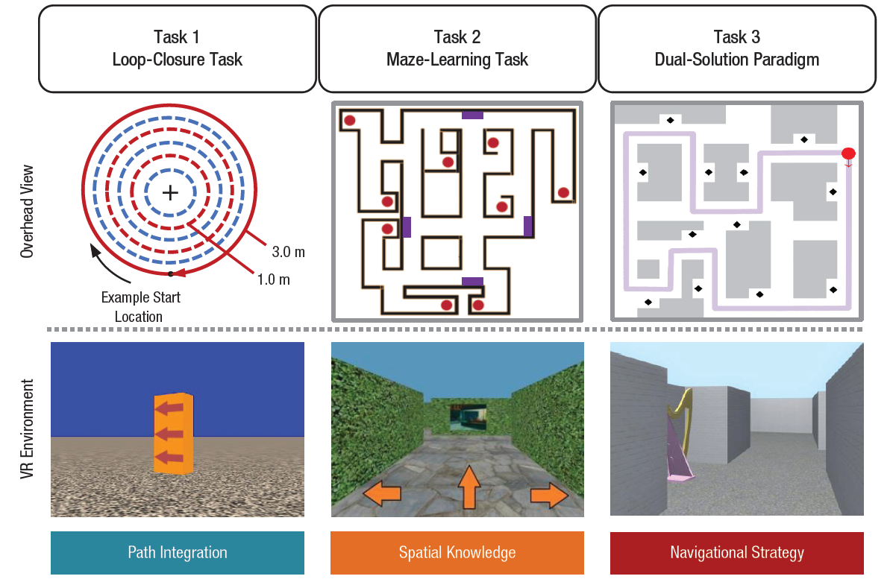

```{r setup, include = TRUE, warning = FALSE, message= FALSE}
knitr::opts_chunk$set(echo = TRUE, warning = FALSE, message= FALSE,
                      fig.align = "center")

#Attach packages
#General
library(tidyverse)
library(dplyr)
library(here)
library(janitor)
library(ggfortify) 
library(RColorBrewer)
library(kableExtra)

#Correlations
library(Hmisc)
library(corrplot)

#ANOVA stats
library(car)
library(sjstats)
library(pwr)
library(effectsize)
library(Rmisc)
#library(rstatix)
```


This analysis was originally conducted between the years 2019-2020. This work was published in the journal *Psychological Science* in 2021: https://doi.org/10.1177/0956797620979185.

The GitHub repository is linked here: https://github.com/esswhy/snag

# Introduction

In this project, I used analysis of variance (ANOVA), analysis of covariance (ANCOVA), and T-test methods to analyze whether there are behavioral differences in spatial navigation performance between different age groups (midlife and young) and sex (women and men). Three different aspects of navigation behavior were tested (path integration, wayfinding success, and navigational strategy) in order to gain a comprehensive understanding of which navigation behaviors are sensitive to changes with age and by sex.


# Research Question

```{r include=FALSE, echo=TRUE}
#Counter for questions
mycounter_qs <- 0
```


Do age-related changes emerge by midlife and do sex differences persist with age?

More specifically, the questions per spatial navigation task were:

`r mycounter_qs <- mycounter_qs +1; mycounter_qs`. &emsp; Do path integration deficits emerge by midlife and differ by sex?

`r mycounter_qs <- mycounter_qs +1; mycounter_qs`. &emsp; Are midlife adults and women less successful than younger adults and men?

`r mycounter_qs <- mycounter_qs +1; mycounter_qs`. &emsp; Do midlife adults and women take fewer shortcuts than younger adults and men?


# Data and Methods

All data and methods are described in the published paper. Briefly, the three navigation tasks included an immersive virtual reality circular path integration task (LOOP), a virtual desktop wayfinding task (MAZE), and a virtual dual-solutions paradigm task (DSP) (**Figure 1**).


**Figure 1.** Three VR tasks probe unique aspects of navigation ability. *Task 1: LOOP.* Participants track their movements as they move through various radii of a circle. *Task 2: MAZE.* Participants explore, navigate, learn, and reach target objects in a maze environment without feedback. *Task 3: DSP.* Participants trained in a maze environment and take either the learned route or shortcuts to reach target objects. Source: Yu et al., 2021.

<br>

Overall,*n* = 115 adults from the University of California, Santa Barbara, and the greater Santa Barbara community participated in the study. These consisted of 85 young adults (39 women; age range 18–28 years, *M* = 19.81, *SD* = $\pm$ 1.87) and 66 midlife adults (40 women; age range 43–61 years, *M* = 51.14, *SD* = $\pm$ 4.07).

Due to technical issues from equipment and motion simulator sickness, some participants could not complete all three tasks or were excluded from data analysis because of insufficient trials. Thus, each task had different sample sizes. These final sample sizes for each task is reported in the table below.


```{r demo-table}
##### Table showing samples sizes for overall and by task

#Read in LOOP, MAZE, DSP data
df_loop <- read_csv(here("data", "snag",
                         "snag_behavior_loop.csv")) %>% clean_names()
df_maze <- read_csv(here("data", "snag",
                         "snag_behavior_maze.csv")) %>% clean_names()
df_dsp <- read_csv(here("data", "snag",
                         "snag_behavior_dsp.csv")) %>% clean_names()

#Table LOOP
tab_loop <- df_loop %>% 
  dplyr::group_by(group, sex) %>% 
  dplyr::summarize(n_subject = n()) 

#Table MAZE
tab_maze <- df_maze %>% 
  dplyr::group_by(group, sex) %>% 
  dplyr::summarize(n_subject = n()) 

#Table DSP
tab_dsp <- df_dsp %>% 
  dplyr::group_by(group, sex) %>% 
  dplyr::summarize(n_subject = n()) 

#Join df based on group and sex
tab1 <- merge(tab_loop, tab_maze, by = c("group", "sex"))

#Rename columns
tab1 <- tab1 %>% 
  rename(n_subject_loop = n_subject.x,
         n_subject_maze = n_subject.y)

#Rest of the merge
tab_final <- merge(tab1, tab_dsp, by = c("group", "sex"))

#Rename columns
tab_final <- tab_final %>% 
  rename(n_subject_dsp = n_subject)
  
tab_final <- tab_final %>% 
  #Remove age group
  select(-group)

#Kable presentation (ideal if we had all hormones)
tab_final %>% 
  kable(col.names = c("Sex",
                      "LOOP", "MAZE", "DSP"),
        
        #Change alignment
        align = c("c", "c", "c"),
        
        caption = "Sample sizes for analysis for each spatial navigation
        task grouped by age and sex.",
  
        #Change width of table
        table.attr = "style='width:80%;'") %>% 
  
  #Extra styling
  kable_styling(bootstrap_options = c("hover", "striped"),
                position = "center", 
                font_size = 12) %>% 
  
  #Add columsn above
  add_header_above(c(" " = 1, "Spatial Navigation Task" = 3)) %>% 
  
  #Group rows
  pack_rows("Midlife Adults", 1, 2) %>%
  pack_rows("Young Adults", 3, 4)
```


**LOOP:** 

For LOOP, the variables of interest were position error, position error variability, degrees traveled, and degrees traveled variability for each radius on the circle (1.0m, 2.0m, and 3.0m). Position error is the straight-line distance between the actual starting location for each trial and the location that the participant indicated was the start. Total degrees traveled represents the number of degrees traveled around the circular path (which can be greater than, less than, or equal to 360$^{\circ}$).

A mixed-model analysis of variance (ANOVA) was conducted for the four outcome measures with a 2 (age group: midlife, young) $\times$ 2 (sex: women, men) $\times$ 3 (radius size: 1.0m, 2.0m, 3.0m) design. Corrections for sphericity were made where appropriate using the Greenhouse-Geisser correction

**MAZE:**

For MAZE, the variables of interest were accuracy or wayfinding success, and the number of moves made during exploration. Wayfinding success is a measure of spatial-knowledge acquisition based on free exploration, and was defined as the proportion of trials that the participant reached the correct target object in time during the test phase. Number of moves made were the number of key presses made to navigate the environment during the learning or exploration phase.

A 2 (age group: midlife, young) $\times$ 2 (sex: women, men) between-subjects ANOVA was conducted to assess group differences in each of these variables. Pearson’s correlation assessed the relationship between the number of moves made during the exploration phase and navigation success in the test phase. An analysis of covariance (ANCOVA) examined the effects of age and sex on navigation success after controlling for the number of moves made by participants during maze exploration.


**DSP:**

For DSP, the variables of interest were wayfinding success and solution index. Wayfinding success was defined as the proportion of trials on which the participant reached the target object within the time limit. Solution index was defined as the number of shortcuts (the shortest possible route) divided by the number of successful trials (a measure of strategy).

A 2 (age group: midlife, young) $\times$ 2 (sex: women, men) between-subjects ANOVA was performed on each dependent variable. Heatmaps were generated to qualitatively gauge the trajectory of where participants traveled along the maze during the testing phase of the task.

All analyses were conducted in R version 4.1.1 and RStudio version 1.4.1717.


# Results

## Exploratory Data Analysis

We asked whether the navigation task variables were correlated with one another. Because correlations require observations with the same vector length, this was done only for participants who have all tasks completed.

```{r}
##### Generate data for correlation

#Read in data
corr_dat <- read_csv(here("data", "snag", 
                          "snag_behavior_correlations.csv"))

#Remove SubjectID column
corr_dat <- corr_dat[,c(2:13)]


##### Convert to table that includes p-values and coefficient

#Code modified from Reference [1] and [2]
#coeff_mat: matrix of the correlation coefficients
#p_mat : matrix of the correlation p-values
CorMat <- function(coeff_mat, p_mat) {
  
  #Save upper half triangle of coefficients
  #This is because the other half is redundant
  up_half <- upper.tri(coeff_mat)

  #Save into dataframe
  data.frame(

    #Variable 1
    Var1 = rownames(coeff_mat)[row(coeff_mat)[up_half]],
  
    #Variable 2
    Var2 = rownames(coeff_mat)[col(coeff_mat)[up_half]],
    
    #Correlation coefficient
    Corr =(coeff_mat)[up_half],
    #p-value
    p_value = p_mat[up_half]
    
)
}

#Pearson correlation
res2 <- rcorr(as.matrix(corr_dat), type="pearson")

#res2$r = correlation coefficient
#res2$P = associated p-value

#Present as table to scroll
CorMat(res2$r, res2$P) %>% 
  
  #Rename columns
  kable(col.names = c("Variable 1", "Variable 2",
                      "Coefficient", "p-value"),
        
        #Change alignment
        align = c("l", "l", "l", "l"),
        
        #Add caption
        caption = "Pearson correlation coefficients and <i>p</i>-values for
                   different pairs of variables.",
        
        #Change width of table
        table.attr = "style='width:80%;'") %>% 
  
  #Make table striped and hover
  kable_styling(bootstrap_options = c("hover", "striped"),
                
                #Center table
                position = "center") %>% 
  
  #Add scroll box
  scroll_box(width = "100%", height = "300px", 
             fixed_thead = list(enabled = T))
```

In the pointing task (SOT), one of the neuropsychological batteries administered prior to the three main navigation tasks, angle and error are negatively correlated. The more accurate subjects are at selecting the correct angle, the less errors they make.

We can see that the wayfinding measures from DSP and MAZE are significantly positively correlated, indicating that performance in successfully and accurately completing trials are related in both tasks. Variability in position error and degrees traveled are also significantly correlated.

```{r}
#Numbers are correlation coefficients
#Colored squares are those that meet significance (alpha = 0.05)

#Color palette and code taken from Reference [1] and [2]
col <- colorRampPalette(c("#BB4444", "#EE9988", "#FFFFFF", "#77AADD", "#4477AA"))

corrplot(res2$r, method = "color", col = col(200),
         type = "upper", order = "hclust",
         
         #Add coefficient of correlation
         addCoef.col = "black",
         
         #Text label color and rotation
         tl.col = "black", tl.srt = 45,
         
         #Combine with significance
         p.mat = res2$P, sig.level = 0.05, number.cex = 0.6, 
         insig = "label_sig", pch.cex = 1, pch.col = "green",
         
         #Hide correlation coefficient on the principal diagonal
         diag = FALSE
)
```

**Figure 2.** Correlation matrix plot of participants with all spatial navigation task variables completed (*n* = 41). Positive correlations are displayed in blue while negative correlations are displayed in red. Color intensity is proportional to the correlation coefficient, as shown by the color bar on the right. Numbers represent the Pearson correlation coefficient and the green asterisk represents a significant association between the variables ($\alpha$ = 0.05). 

<br>

Overall, the DSP and MAZE wayfinding success measures are the most interesting (but expected) positive association. In general, there are no other major associations of interest or concern.


## LOOP

(CREATE NEW FIGURE)

## MAZE

### Test Against Chance Level

### Wayfinding Success

### Number of Moves

### ANCOVA


(CREATE NEW FIGURE)

## DSP

### Wayfinding Success

### Solution Index

```{r}
#ANOVA set contrasts
options(contrasts=c("contr.sum", "contr.poly"))
interaction_SI <- aov(si_strict ~ group*sex, data = df_dsp)

#Run ANOVA and present in tidy format
tidy_si <- broom::tidy(Anova(interaction_SI, type="III"))
tidy_si

#Present as table
tidy_si %>% 
  kable(col.names = c("Variable", "Sum of Squares",
                      "Degrees of Freedom", "Statistic", "p-value"),
        
        #Change alignment
        align = c(rep("l",2), "c", rep("l", 2)),
        
        caption = "ANOVA table of results for DSP solution index.",
  
        #Change width of table
        table.attr = "style='width:80%;'") %>% 
  
  #Extra styling
  kable_styling(bootstrap_options = c("hover", "striped"),
                position = "center", 
                font_size = 12)
```


```{r}
#Statistics from ANOVA
aov_si <- Anova(interaction_SI, type="III")
anova_stats(aov_si)
```


```{r}
#Partial eta squared based on bootstrapping
effectsize::eta_squared(aov_si, partial = TRUE)
```

We can summarize the descriptive statistics for DSP solution index.


```{r}
#Table of mean and sd of SI by age 
tab_si_stats_group <- df_dsp %>% 
  dplyr::group_by(group) %>% 
  dplyr::rename(variable = group) %>% 
  dplyr::summarize(count = n(),
                   mean_si = mean(si_strict),
                   sd_si = sd(si_strict),
                   ci_si = CI(si_strict, ci = 0.95)) %>% 
  #Ungroup
  dplyr::ungroup(variable) %>% 
  
  #Add columns for CI labels
  mutate(ci_label = rep(c("upper", "mean", "lower"), 2)) %>% 
  
  #Long to wide
  pivot_wider(names_from = ci_label,
              values_from = ci_si) %>%
  
  #Remove mean
  select(-mean) %>% 
  
  #Move upper and lower columns
  relocate(lower, .before = "upper")


#Table of mean and sd of SI by sex
tab_si_stats_sex <- df_dsp %>% 
  dplyr::group_by(sex) %>% 
  dplyr::rename(variable = sex) %>% 
  dplyr::summarize(count = n(),
                   mean_si = mean(si_strict),
                   sd_si = sd(si_strict),
                   ci_si = CI(si_strict, ci = 0.95)) %>% 
  #Ungroup
  dplyr::ungroup(variable) %>% 
  
  #Add columns for CI labels
  mutate(ci_label = rep(c("upper", "mean", "lower"), 2)) %>% 
  
  #Long to wide
  pivot_wider(names_from = ci_label,
              values_from = ci_si) %>%
  
  #Remove mean
  select(-mean) %>% 
  
  #Move upper and lower columns
  relocate(lower, .before = "upper") 


#Combine tables
tab_si_stats <- rbind(tab_si_stats_group,
                      tab_si_stats_sex)

  
#Kable presentation
tab_si_stats %>% 
  kable(col.names = c("", "Count",
                      "Mean", "SD", "Lower", "Upper"),
        align = c(rep("c", 2), rep("l", 2)),
        caption = "Descriptive statistics for DSP solution 
        index by age and sex.",
        digits = 3,
        #Change width of table
        table.attr = "style='width:80%;'") %>% 
  
  #Add columns above
  add_header_above(c(" " = 4, "95% Confidence Interval" = 2)) %>%
  
  #Extra styling
  kable_styling(bootstrap_options = c("hover", "striped"),
                position = "center", 
                font_size = 12) %>% 
  
  #Group rows
  pack_rows("Age Group", 1, 2) %>%
  pack_rows("Sex", 3, 4)
```


```{r}
#Table of mean and sd of SI by age and sex
tab_si_stats <- df_dsp %>% 
  dplyr::group_by(group, sex) %>% 
  dplyr::summarize(count = n(),
                   mean_si = mean(si_strict),
                   sd_si = sd(si_strict),
                   ci_si = CI(si_strict, ci = 0.95)) %>% 
  #Ungroup
  dplyr::ungroup() %>% select(-group) %>% 
  
  #Add columns for CI labels
  mutate(ci_label = rep(c("upper", "mean", "lower"), 4)) %>% 
  
  #Long to wide
  pivot_wider(names_from = ci_label,
              values_from = ci_si) %>%
  
  #Remove mean
  select(-mean) %>% 
  
  #Move upper and lower columns
  relocate(lower, .before = "upper")
  
#Kable presentation
tab_si_stats %>% 
  kable(col.names = c("Sex", "Count",
                      "Mean", "SD", "Lower", "Upper"),
        align = c(rep("c", 2), rep("l", 2)),
        caption = "Descriptive statistics for DSP solution 
        index by each age and sex group.",
        digits = 3,
        #Change width of table
        table.attr = "style='width:80%;'") %>% 
  
  #Add columns above
  add_header_above(c(" " = 4, "95% Confidence Interval" = 2)) %>% 
  
  #Extra styling
  kable_styling(bootstrap_options = c("hover", "striped"),
                position = "center", 
                font_size = 12) %>% 
  
  #Group rows
  pack_rows("Midlife Adults", 1, 2) %>%
  pack_rows("Young Adults", 3, 4)
```

After running ANOVA, we can investigate post-hoc effects to observe whether there is an effect of sex at each level of age group, and whether there is an effect of age group between each level of sex.

```{r}
#Effect of sex at each level of age group
df_dsp %>%
  group_by(group) %>%
  anova_test(si_strict ~ sex,
             type = "III",
             effect.size = "pes") %>%
  get_anova_table() %>%
  adjust_pvalue(method = "bonferroni") %>% 
  kable(col.names = c("Age Group", "Effect", "Degrees Freedom, numerator",
                      "Degrees Freedom, denominator", "F-value",
                      "p-value", "Significant", "Partial Eta Sq.",
                      "Bonferroni Adjusted p-value"),
        
        #Change alignment
        align = c(rep("l",2), rep("c",2), rep("l", 2),
                  "c", rep("l", 2)),
        
        caption = "Post-hoc ANOVA table of results for the effect of
        sex at each level of age group for DSP solution index.",
  
        #Change width of table
        table.attr = "style='width:95%;'"
        ) %>% 
  
  #Extra styling
  kable_styling(bootstrap_options = c("hover", "striped"),
                position = "center", 
                font_size = 12)
```


Next we can find the effect size of each treatment of sex on the different age groups.


### Heatmaps

(CREATE NEW FIGURE)

# Summary

# References

## Data and Literature

Yu, S., Boone, A.P., He, C., Davis, R.C., Hegarty, M., Chrastil, E.R., & Jacobs, E.G. (2021). Age-Related Changes in Spatial Navigation Are Evident by Midlife and Differ by Sex. Psychological Science, 32(5), 692-704. https://doi.org/10.1177/0956797620979185.

Correlation matrix : A quick start guide to analyze, format and visualize a correlation matrix using R softwards. http://www.sthda.com/english/wiki/correlation-matrix-a-quick-start-guide-to-analyzeformat-and-visualize-a-correlation-matrix-using-r-software

Visualize correlation matrix using correlogram. http://www.sthda.com/english/wiki/visualizecorrelation-matrix-using-correlogram

## R Libraries


