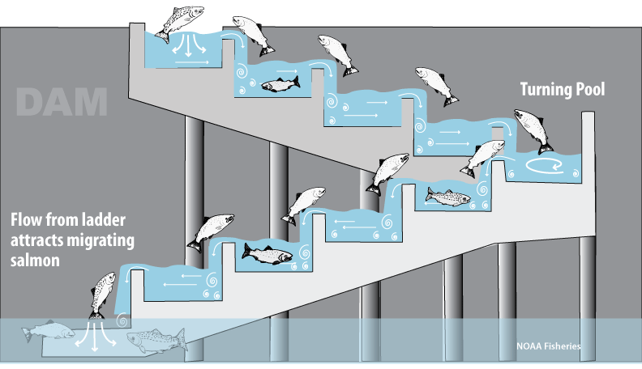
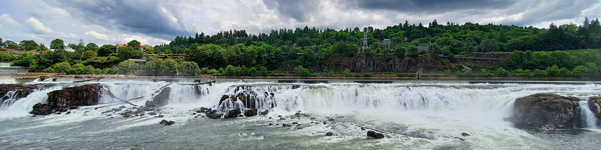

```{r setup, include = TRUE, warning = FALSE, message = FALSE}
knitr::opts_chunk$set(echo = TRUE, warning = FALSE, message = FALSE,
                      fig.align = "center")

#Attach packages
library(tidyverse)
library(here)
library(janitor)
library(paletteer)

#For map
library(ggmap)

#For time series analysis
library(lubridate)
library(tsibble)
library(feasts)
```

# Introduction

In this project, I explored time series of adult salmon passage at the Willamette Falls fish ladder on the Willamette River in Oregon, United States. Time series analysis was used to explore cyclical and seasonal trends in historical data recorded for a period of 10 years for three different species of adult salmon.






**Figure 1.** _(Top)_ Diagram of migrating fish swimming up fish ladder to bypass dam. Source: NOAA Fisheries. _(Bottom)_ Willamette River at Willamette Falls in Oregon City, south of Portland. Source: Portland General Electric.

<br>

# Research Question

Are there any cyclical, seasonality, or general trends in the time series of fish passage at Willamette Falls fish ladder for different species of salmon? To understand the structure of the time series data, the data will be decomposed to explore the contributions of individual components, including a daily time series plot, seasonplots, and an anverage annual total plot.

# Data and Methods

Coho, Jack Coho, and Steelhead adult salmon passage counts were recorded at the Willamette Falls fish ladder on the Willamette River in Oregon, United States (**Figure 2**) between 2001-01-01 to 2010-12-31, and the data is made publicly available by Columbia River DART (Data Access in Real Time) which was accessed on 03/022/2022. Columbia River DART is a data resource compiling information relating to the Columbia Basin salmon populations and environmental river conditions from federal, state, and tribal databases.

```{r map}
#Map of Willamette River

#Longitude and latitude for where Willamette River area is
longs <- seq(-122.65, -122.55, by = 0.01)
lats <- seq(45.33, 45.4, by = 0.01)

#Define box to zoom in
zoomed_in <- make_bbox(lon = longs, lat = lats, f = .01)

#Get map
willamette_map <- get_map(location = zoomed_in,
                          maptype = "satellite",
                          source = "google") 

#Map of Willamette Falls
ggmap(willamette_map) +
  
  #Coordinates from GeoHack
  geom_point(aes(x = -122.619727,
                 y = 45.35239),
                 #y = 45.3511544),
             
             #Change point color, size, shape
             fill = "darkorange", 
             size = 4, shape = 23) +
  
  #Change x-axis and y-axis label
  labs(x = "\nLatitude", 
       y = "Longitude\n") +
  
  #Add custom theme
  theme(plot.background = element_blank(),
        
        #Bold axes labels
        axis.title = element_text(face = "bold", size = 11),
        
        #Change size of axes ticks
        axis.text = element_text(size = 10))
```

**Figure 2.** Location of Willamette Falls fish ladder (orange diamond) in Clackamas County, Oregon, United States. Data source: GeoHack (Accessed 03/07/2022).

<br>

Fish at the Willamette Falls fish ladder were counted at the main viewing window. Video cameras and time lapsed video recorders were used to record fish passage 24 hours/day, 365 days/year. However, the Willamette Falls fish ladder was not operational on the following dates:

-   **2005:**

    -   2005-11-29 to 2005-12-01

    -   2005-12-06 to 2005-12-08

    -   2005-12-13 to 2005-12-14

-   **2008:**

    -   2008-08-26 to 2008-09-21

-   **2010:**

    -   2010-08-23 to 2010-08-27

Three different time series plots were created to observe for patterns in adult salmon passage. The daily time series plot for each species shows the overall seasonality and trend from the years 2001-2010. Seasonplots for each species show the annual monthly total salmon passage for each year the data was observed. Lastly, a time series plot of the average annual total salmon passage was created showing differences in counts between the three different salmon species. All analyses were conducted in R version 4.1.1 and RStudio version 1.4.1717.

# Results {.tabset}

```{r}
#Read in the data
salmon <- read_csv(here("data", "willamette_fish_passage.csv"))


#Wrangle the data
salmon_ts <- salmon %>% 
  
  #Change variable names to lowercase
  clean_names() %>% 
  
  #Convert date to YMD instead of MDY
  mutate(date = lubridate::mdy(date)) %>%
  
  #Select only date and salmon of interest
  select(date, coho, jack_coho, steelhead) %>%
  
  #Replace NA values with 0
  replace_na(list(coho = 0, jack_coho = 0, steelhead = 0)) %>%
  
  #Pivot longer to get count of fish
  pivot_longer(c(coho:steelhead),
               names_to = "species", 
               values_to = "count") %>% 
  
  #Remove the negative counts, keep counts >= 0
  filter(count >= 0) %>% 
  
  #Recode salmon species name for capitalization
  mutate(species = recode(species,
                          coho = "Coho",
                          jack_coho = "Jack Coho",
                          steelhead = "Steelhead")) %>% 

  #Make into time series object: convert to tsibble
  as_tsibble(key = species, index = date)
```

## Daily Time Series by Species

```{r daily-time-series-species, preview=TRUE}
#Define salmon colors
species_colors <- c("cadetblue4", "mediumvioletred", "darkorange")

#Plot time series by salmon species
ggplot(data = salmon_ts, 
       aes(x = date, 
           y = count)) +
  
  #Define line plot
  #Color by species, change line width
  #Remove legend
  geom_line(aes(color = species), size = 0.7,
            show.legend = FALSE) +
  
  #Facet grid by species
  facet_grid(species ~ .,
             
             #Scale based on individual plot
             scales = "free") +
  
  #Change color of line plots
  scale_color_manual(values = species_colors) +
  
  #Change x-axis and y-axis labels
  labs(x = "\nYear",
       y = "Total Number of Adult Salmon\n") +
  
  #Change theme
  theme_bw() +
  
  #Add custom theme
  #Bold and change size of axes labels
  theme(axis.title = element_text(face = "bold", size = 11),
        
        #Change size of axes ticks
        axis.text = element_text(size = 10),
        
        #Change facet label color
        strip.background = element_blank(),
        
        #Left align figure caption
        plot.caption = element_text(hjust = 0))
```
**Figure 3.** Daily time series of total adult salmon passage for Coho (teal, top), Jack Coho (magenta, middle), and Steelhead (orange, bottom) salmon at the Willamette Falls fish ladder on the Willamette River, Oregon between the years 2001-2010. Data: Columbia River DART (Accessed 03/02/2022).

<br>

It appears that the total count of Coho salmon passage increased (magnitude of counts increased) starting in 2008, showing a pattern that Coho salmon passages appear to be higher towards the end of the year (**Figure 3**). Jack Coho salmon counts were the lowest among the three species, and had low passages in 2001, 2005, and 2007. Passages were highest in 2008. Similar to Coho salmon, Jack Coho adult salmon count increased around the same time which appears to be near the end of each year. Steelhead salmon counts were the highest among the three salmon species, and patterns of increase appear relatively stable throughout 2001-2010. It is possible that the Coho and Jack Coho salmon passages were low as both the species competed for resources, while Steelhead salmon passages were high as they passed by the river at different seasons and thus had less competition for resources.

## Seasonplots by Species

```{r seasonplots}
#Plot by months on x-axis and each line as the year
salmon_month <- salmon_ts %>% 
  
  #Group by key = species
  group_by_key() %>% 
  
  #Group by time series index year month
  index_by(year_month = ~ yearmonth(.)) %>% 
  
  #Summarize mean counts for each month
  summarize(avg_monthly_count = mean(count, na.rm = TRUE))


#Plot salmon species
salmon_month %>% 
  
  #Make seasonplot
  gg_season(y = avg_monthly_count,
            
            #Change palette color
            pal = paletteer_c(palette = "viridis::mako",
                              n = 10)) +
  
  #Change line size
  geom_line(size = 0.8) +
  
  #Change x-axis and y-axis labels
  #Change legent title
  labs(x = "\nMonth",
       y = "Average Monthly Total\n",
       color = "Year") +
  
  #Change theme
  theme_bw() +  
  
  #Add custom theme
  #Bold and change size of axes labels
  theme(axis.title = element_text(face = "bold", size = 11),
        
        #Change size of axes ticks
        axis.text = element_text(size = 10),
        
        #Change facet label color
        strip.background = element_blank())
```
**Figure 4.** Average monthly total or count of adult salmon passage for Coho (top), Jack Coho (middle), and Steelhead (bottom) salmon for each year at the Willamette Falls fish ladder on the Willamette River, Oregon between the years 2001-2010. Data: Columbia River DART (Accessed 03/02/2022).

<br>

Coho and Jack coho adult salmon passage appear to begin after August and peak around the same months (September and October), while Steelhead adult salmon passage at the Willamette Falls fish ladder begins around December and peaks in the late spring or early summer months (May and June) (**Figure 4**). Coho and Jack Coho salmon average monthly totals remain low after November, and Steelhead salmon average monthly totals decrease in the late summer and remain low throughout the fall months. Breaking down the average monthly totals shows a seasonality pattern where Coho and Jack Coho salmon passage mainly occur around the same time during the fall months, while Steelhead salmon passage mainly occur over the range of winter to early summer months.

## Annual Total by Species

```{r annual-total}
#Get annual totals
salmon_annual <- salmon_ts %>% 
  
  #Group by key = species
  group_by_key() %>% 
  
  #Group by time series index year
  index_by(ts_year = ~ year(.)) %>% 
  
  #Summarize annual totals
  summarize(annual_total = sum(count)) %>%
  
  #Convert year to factor
  mutate(year = factor(ts_year)) 


#Create data for averages across all years by species
salmon_annual_avgs <- salmon_annual %>% 
  
  #Group by species
  group_by_key() %>% 
  
  #Create column for averages
  mutate(avg_years = mean(annual_total))


#Plot by months on x-axis and each line as the year
ggplot(data = salmon_annual, aes(x = year, 
                                 y = annual_total,
                                 group = species)) +
  
  #Define point and line plots, color by species
  #Change size and shape for point, change size for line
  geom_point(aes(color = species), size = 3.8, shape = 18) + 
  geom_line(aes(color = species), size = 1) +
  
  #Add average annual total line for species
  #Color by species and change line type, size
  geom_hline(data = salmon_annual_avgs,
             aes(yintercept = avg_years, color = species),
             linetype = "dashed", size = 0.7) +
  
  #Change color of point and lines
  scale_color_manual(values = species_colors) +
  
  #Change x-axis and y-axis
  labs(x = "\nYear",
       y = "Average Annual Total\n",
       color = "Salmon Species") +
  
  #Change theme
  theme_minimal() +  
  
  #Add custom theme
  #Bold and change size of axes labels
  theme(axis.title = element_text(face = "bold", size = 11),
        
        #Change size of axes ticks
        axis.text = element_text(size = 10),
        
        #Change legend position
        legend.position = c(0.7, 0.79))
```
**Figure 5.** Average annual total or count of adult salmon passage for Coho (teal), Jack Coho (magenta), and Steelhead (orange) salmon at the Willamette Falls fish ladder on the Willamette River, Oregon between the years 2001-2010. Dashed lines represent the overall average annual adult salmon passage across all years for each salmon species. Data: Columbia River DART (Accessed 03/02/2022).

<br>

Annual total Coho salmon passage remained relatively consistent throughout the years, with the exception of 2009 and 2010 when adult salmon passage increased by at least 10,000 (**Figure 5**). The trend in average total Jack Coho salmon passage appears to increase over the years, while the average total for Steelhead salmon passage appears to decrease. Jack Coho salmon had the lowest annual total every year except for 2002 when adult salmon passage was similar to that of Coho salmon. Steelhead salmon had the highest annual total every year except for 2009 when Coho salmon passage was the highest. Overall, adult salmon passage for all three species was above average for 2010, while adult salmon passage for all three species was below average for 2005-2007.

#  {-}


# Summary

In conclusion, exploration of time series on adult salmon passage at Willamette Falls fish ladder reveals differences between species in the following trends:

-   Daily time series plot reveals that Steelhead salmon had the highest population counts passing through the fish ladder, while Coho and Jack Coho salmon had the lowest population counts

-   Monthly time series from seasonplots reveal that Steelhead salmon migration occur between winter and early summer, while Coho and Jack Coho salmon migrations occur only during the fall months

-   Annual time series calculating average annual counts of adult salmon passage reveal a trend that Coho salmon tend to be stable over the years, while Steelhead salmon appear to be decreasing and Jack Coho salmon appear to be increasing for 2009 and 2010

# References

## Data and Literature

Columbia Basin Research DART (Data Access in Real Time). Accessed 03/02/2022. DART Adult Passage Graphics & Text. <http://www.cbr.washington.edu/dart/query/adult_graph_text>.

GeoHack - Willamette Falls. Accessed 03/07/2022. <https://geohack.toolforge.org/geohack.php?pagename=Willamette_Falls&params=45.35239_N_122.61763_W_type:landmark_region:US-OR_scale:50000>.

National Oceanic and Atmospheric Administration (NOAA) Fisheries. (2019). Adult Upstream Passage on the West Coast. <https://www.fisheries.noaa.gov/west-coast/endangered-species-conservation/adult-upstream-passage-west-coast>.

Portland General Electric. Willamette River. https://portlandgeneral.com/about/rec-fish/willamette-river.

## R Libraries

Firke, S. (2021). janitor: Simple Tools for Examining and Cleaning Dirty Data. R package version 2.1.0. <https://CRAN.R-project.org/package=janitor>.

Grolemund, G. & Wickham, H. (2011). Dates and Times Made Easy with lubridate. Journal of Statistical Software, 40(3), 1-25. URL <https://www.jstatsoft.org/v40/i03/>.

Hvitfeldt, E. (2021). paletteer: Comprehensive Collection of Color Palettes. version 1.3.0. <https://github.com/EmilHvitfeldt/paletteer>.

Kahle, D. & Wickham, H. ggmap: Spatial Visualization with ggplot2. The R Journal, 5(1), 144-161. URL <http://journal.r-project.org/archive/2013-1/kahle-wickham.pdf>.

Müller, K. (2020). here: A Simpler Way to Find Your Files. R package version 1.0.1. <https://CRAN.R-project.org/package=here>.

O'Hara-Wild, M., Hyndman, R. & Wang, E. (2021). feasts: Feature Extraction and Statistics for Time Series. R package version 0.2.2. <https://CRAN.R-project.org/package=feasts>.

Wang, E., Cook, D. & Hyndman, R.J. (2020). A new tidy data structure to support exploration and modeling of temporal data, Journal of Computational and Graphical Statistics, 29:3, 466-478, <doi:10.1080/10618600.2019.1695624>.

Wickham et al., (2019). Welcome to the tidyverse. Journal of Open Source Software, 4(43), 1686, <https://doi.org/10.21105/joss.01686>.

