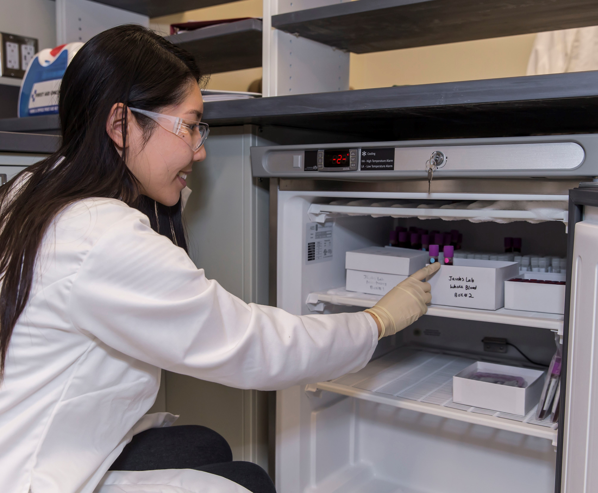

```{r setup, include=FALSE}
knitr::opts_chunk$set(echo = FALSE)

#Libraries
library(here)
```


I am a researcher and data analyst with years of experience conducting quantitative and qualitative research in laboratory, field, and online settings. Currently, I work at the University of California, Santa Barbara as a **Ph.D. Candidate in Psychological & Brain Sciences** where I employ advanced statistical methods to interpret data gathered from surveys, experiments, and large datasets from multiple, collaborative projects. These methods include A/B testing, logistic and linear regressions, univariate and multivariate analyses, and multi-level modeling using statistical software packages such as R, Python, MATLAB, and Excel. I maintain a robust and reproducible workflow using version-controlled projects with Github and use R Markdown and Jupyter Notebook to write and share reports.

I am interested in building my research and data science toolbox by staying actively involved in the Software Carpentry, RStudio, and TidyTuesday communities. I plan to continue learning advanced methods for analyzing and communicating data, such as Bayesian analysis, forecasting, and other machine learning methods. Please check out the website tabs for my [portfolio](https://esswhy.github.io/portfolio.html) and [blog](https://esswhy.github.io/blog.html) to learn more.


Throughout my many years as a scholar and educator working in multiple research laboratories, I have learned that open communication, collaborative teamwork, and compassionate support are paramount in generating quality scientific research. I hope to apply the skills I have developed to help solve real-world problems upon graduating.


# Academic Research

In my research as a Ph.D. Candidate in the Psychological & Brain Sciences Department, I work with [Emily G. Jacobs, Ph.D.](https://jacobs.psych.ucsb.edu/) to investigate the role of sex steroid hormones on spatial navigation abilities and strategies in midlife women and men. The midlife period is characterized by declining ovarian hormone production as women transition to menopause and behavioral and cognitive changes unfold, a natural process known as reproductive aging. My research aims to investigate the influence of declining sex steroid hormones on brain regions that are crucial for supporting successful spatial navigation performance. 

The outcomes of my research have practical importance and benefits to society that lead to greater advancement in educational, psychological, and medical fields — including understanding healthy brain aging, advancing knowledge for the intersection of women's health and neuroscience, and identifying early cognitive markers for dementia.



Outside of the lab, I enjoy participating in community outreach events at science fairs, hosting laboratory tours, and teaming up with the local chapter of Girls Inc., an organization dedicated to introducing young girls to STEM. Together, these experiences continue to solidify my commitment to fostering the growth of my community and in sharing science with the public throughout my career. Please see my [publications and scientific communications](https://esswhy.github.io/scientific_communication.html) tab to learn more!


# Personal

In my free time, I love watching YouTube, making art, and baking pastries and sweets with Asian-inspired flavors. I am a proud first-generation college student and first-generation American, and am continually finding ways to re-establish connections to my roots and joining communities to preserve and share my family's stories.

