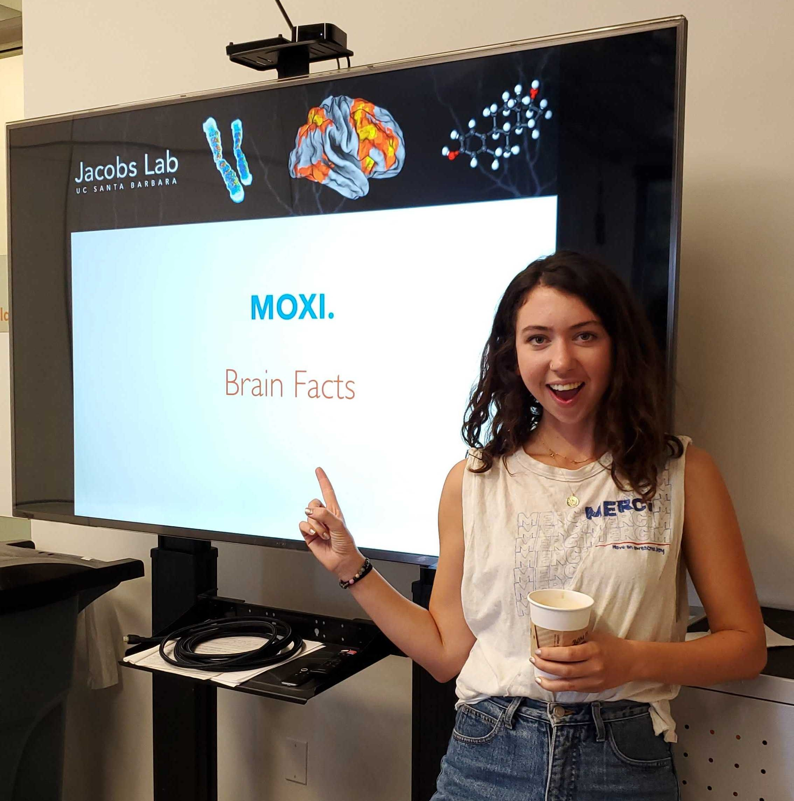
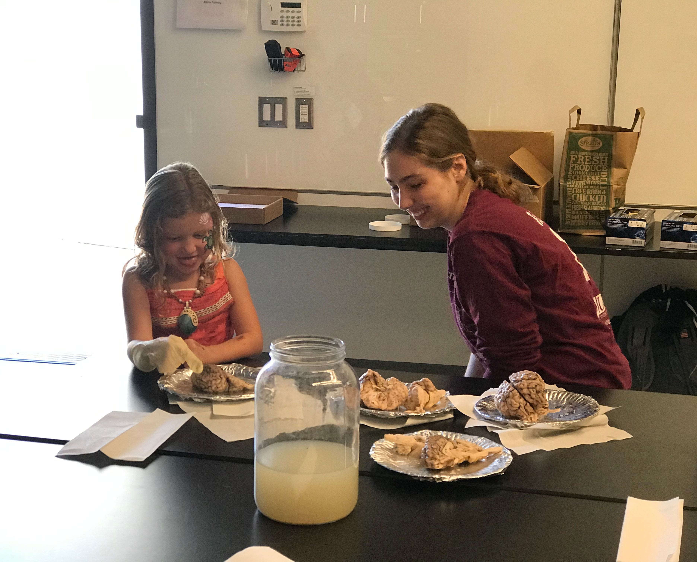
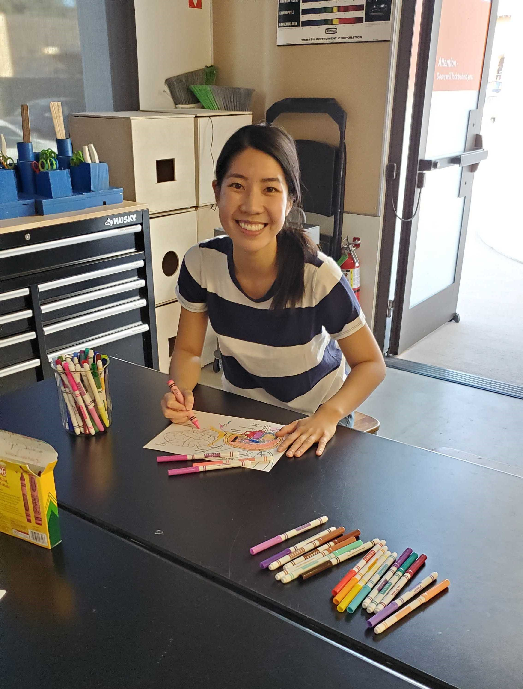
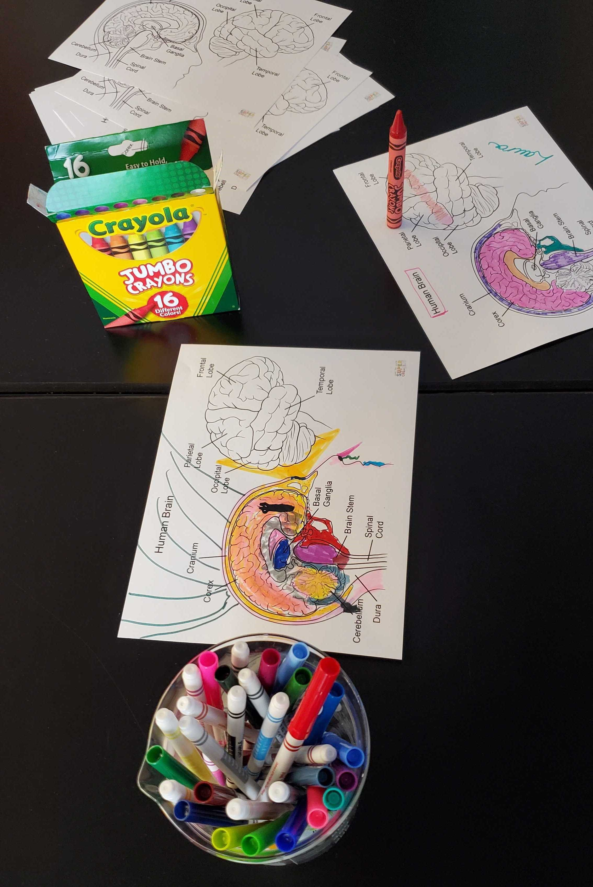
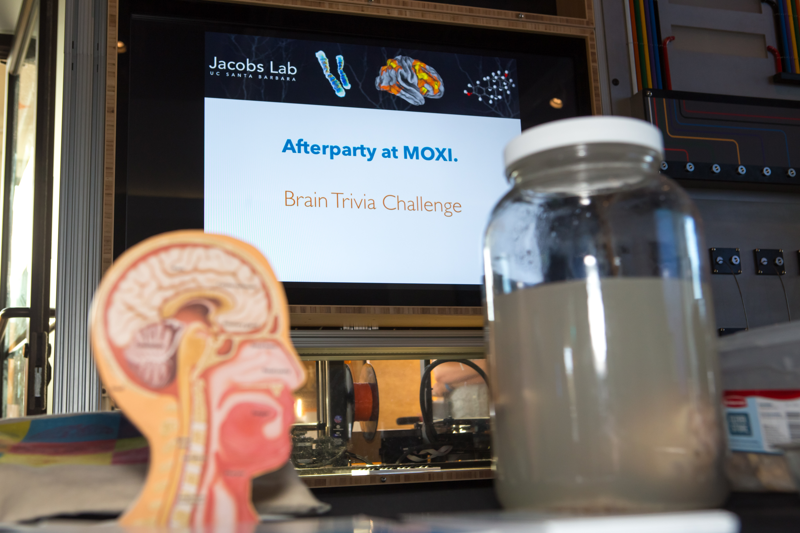
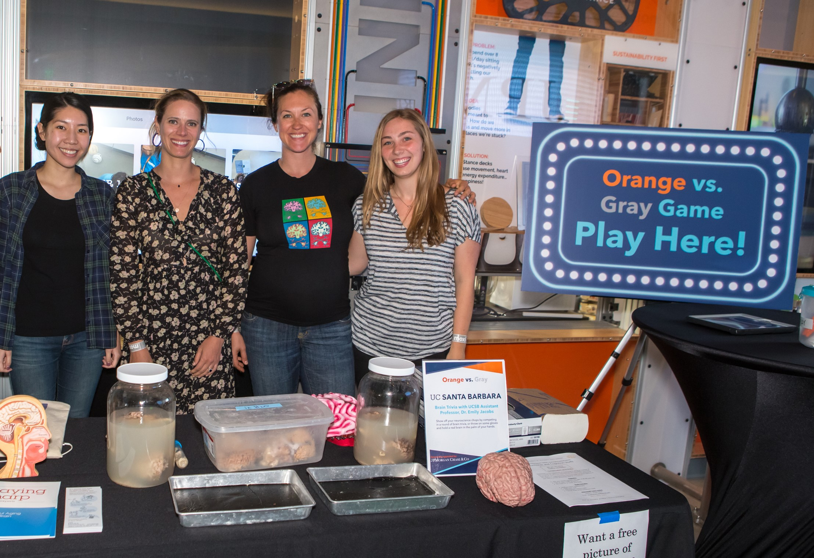
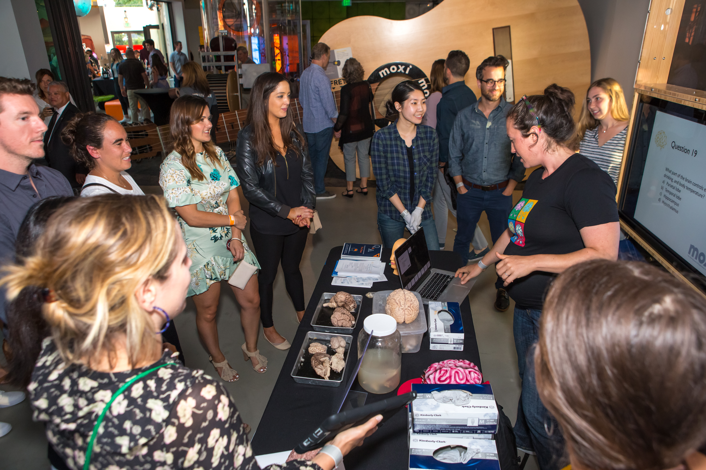

 
```{r setup, include=FALSE}
knitr::opts_chunk$set(echo = FALSE)


##### Libraries
library(here)
library("vembedr")


##### Number counters

#Counter for publications
mycounter_pubs <- 0

#Counter for presentation talks
mycounter_talks <- 0

#Counter for presentation posters
mycounter_posters <- 0

#Counter for videos
mycounter_videos <- 0

#Counter for community outreach posts
mycounter_outreach <- 0


#Adding `&emsp;` is four spaces
#Addint `&ensp;` is two spaces
```


# Publications

`r mycounter_pubs <- mycounter_pubs +1; mycounter_pubs`. &emsp; **Yu. S.**, Hegarty, M., Chrastil, E.R., & Jacobs, E.G. (*Manuscript In Preparation*). Sex steroid hormones associated with spatial navigational strategy in midlife women. 

`r mycounter_pubs <- mycounter_pubs +1; mycounter_pubs`. &emsp; Snider, J., Hacker, S., **Yu, S.**, Townsend, J., & Chukoskie, L. (*Manuscript Under Review*). Change blindness and eye tracking in children with autism. 

`r mycounter_pubs <- mycounter_pubs +1; mycounter_pubs`. &emsp; Hegarty, M., He, C., Boone, A.P., **Yu, S.**, Jacobs, E.G., & Chrastil, E.R. (2022). Understanding Differences in Wayfinding Strategies. *Topics in Cognitive Science*. https://doi.org/10.1111/tops.12592.

`r mycounter_pubs <- mycounter_pubs +1; mycounter_pubs`. &emsp; **Yu, S.**, Boone, A.P., He, C., Davis, R.C., Hegarty, M., Chrastil, E.R., & Jacobs, E.G. (2021). Age-Related Changes in Spatial Navigation Are Evident by Midlife and Differ by Sex. *Psychological Science*, 32(5), 692-704. https://doi.org/10.1177/0956797620979185. **_Featured in Association for Psychological Science's "This Week in Psychological Science" exclusive newsletter._**

`r mycounter_pubs <- mycounter_pubs +1; mycounter_pubs`. &emsp; Pritschet, L., Santander, T., Taylor, C.M., Layher, E., **Yu, S.**, Miller, M.B., Grafton, S.T., & Jacobs, E.G. (2020). Functional reorganization of brain networks across the human menstrual cycle. *NeuroImage*, 220, 117091. https://doi.org/10.1016/j.neuroimage.2020.117091.

`r mycounter_pubs <- mycounter_pubs +1; mycounter_pubs`. &emsp; Taylor, C.M., Pritschet, L., **Yu, S.**, & Jacobs, E.G. (2019). Applying a Women’s Health Lens to the Study of the Aging Brain. *Frontiers in human neuroscience*, 13, 224. https://doi.org/10.3389/fnhum.2019.00224.

`r mycounter_pubs <- mycounter_pubs +1; mycounter_pubs`. &emsp; Suarez, N.A., Samano, M., **Yu, S.**, Snyder, S. & Chukoskie, L. (2019). Research-practice partnerships in STEM informal learning environments. In P.K. Kuhl, S-S. Lim, S. Guerriero & D. Van Damme (Eds.), *Developing Minds in the Digital Age: Towards a Science of Learning for 21st Century Education*, (pp. 187-195). Paris, France: Educational Research and Innovation, OECD Publishing. https://doi.org/10.1787/562a8659-en. _(See <a href="#outreach">Outreach</a> to learn more.)_


# Presentations

## Talks

`r mycounter_talks <- mycounter_talks +1; mycounter_talks`. &emsp; **Yu, S.** (May 2022). The Role of Reproductive Aging on Navigation Strategy in Midlife Women. *7th Annual Psychology in Action Symposium: Healthy Aging*. Virtual Presentation, UCLA Department of Psychology, Los Angeles, CA, USA.

`r mycounter_talks <- mycounter_talks +1; mycounter_talks`. &emsp; **Yu, S.** (September 2021). Sex Differences and Aging in Spatial Navigation. *Lunch & Learn Series*. UCSB Graduate Division, Santa Barbara, CA, USA. **_Highlighted as "the most accessible STEM presentation seen at Lunch & Learn" by the Assistant Director of Professional Development for Graduate Division._** _(See <a href="#videos">Videos</a> to watch talk.)_

`r mycounter_talks <- mycounter_talks +1; mycounter_talks`. &emsp; **Yu, S.**, Boone, A.P., He, C., Davis, R., Hegarty, M., Chrastil, E.R., & Jacobs, E.G. (October 2020). Sex Differences and Age-Related Differences in Spatial Navigation. *3rd Interdisciplinary Navigation Symposium (iNAV)*. Virtual Presentation, Cortina d'Ampezzo, Italy.

`r mycounter_talks <- mycounter_talks +1; mycounter_talks`. &emsp; **Yu, S.** (May 2020). Spatial Navigation, Sex Differences, and Aging. *43rd Annual Minicon*. UCSB Department of Psychological and Brain Sciences, Santa Barbara, CA, USA.

`r mycounter_talks <- mycounter_talks +1; mycounter_talks`. &emsp; **Yu, S.** (March 2020). Why Spatial Navigation is Important. *Invited Guest Lecture for PSY 137: Behavioral Endocrinology*. UCSB Department of Psychological and Brain Sciences, Santa Barbara, CA, USA.

`r mycounter_talks <- mycounter_talks +1; mycounter_talks`. &emsp; **Yu, S.**, Pritschet, L., Taylor, C.M. & Jacobs, E.G. (February 2018). *Cognitive Neuroscience Seminar Series*. UCSB Department of Psychological & Brain Sciences, Santa Barbara, CA, USA.

`r mycounter_talks <- mycounter_talks +1; mycounter_talks`. &emsp; **Yu, S.**, Chu, D. & Nitz, D.A. (June 2016). Role of the Hippocampus and Parietal Cortex in Rule-Based Environmental Fragmentation. *Cognitive Science Undergraduate Honors Thesis Presentations*, La Jolla, CA, USA.

`r mycounter_talks <- mycounter_talks +1; mycounter_talks`. &emsp; **Yu, S.**, Smith, C.N. & Squire, L.R. (April 2016). Eye Movements, Memory, and Awareness of Whether a Scene Is Old or New. *29th Annual Undergraduate Research Conference*, La Jolla, CA, USA.

`r mycounter_talks <- mycounter_talks +1; mycounter_talks`. &emsp; **Yu, S.**, Chukoskie, L. & Townsend, J. (April 2015). Whatcha Looking At? Social and Non-Social Eye Fixations of Children with ASD in a Change Blindness Task. *28th Annual Undergraduate Research Conference*, La Jolla, CA, USA.


## Posters

`r mycounter_posters <- mycounter_posters +1; mycounter_posters`. &emsp; Cossio, D., Sabur, R., **Yu, S.**, Hegarty, M., Jacobs, E.G., & Chrastil, E.R. (November 2022). The relationship between spatial navigation ability during midlife and white matter structural integrity. *2022 Society for Neuroscience Annual Meeting*, San Diego, CA, USA.

`r mycounter_posters <- mycounter_posters +1; mycounter_posters`. &emsp; **Yu, S.**, Hegarty, M., Chrastil, E.R., & Jacobs, E.G. (May 2022). Navigation Strategy Tied to Sex Steroid Hormones. *2022 Organization for the Study of Sex Differences Annual Meeting*, Marina del Rey, CA, USA.

`r mycounter_posters <- mycounter_posters +1; mycounter_posters`. &emsp; **Yu, S.**, Boone, A.P., He, C., Davis, R.C., Hegarty, M., Chrastil, E.R., & Jacobs, E.G. (May 2020). Sex Differences and Age-Related Changes in Spatial Navigation. *2020 Organization for the Study of Sex Differences Annual Meeting*, Marina del Rey, CA, USA. _Abstract accepted but meeting canceled due to COVID-19._

`r mycounter_posters <- mycounter_posters +1; mycounter_posters`. &emsp; Layher, E., Pritschet, L., Santander, T., Taylor, C.M., **Yu, S.**, Grafton, S.T., Jacobs, E.G., & Miller, M.B. (June 2019). Within-subject fMRI analyses of the successful retrieval effect in recognition memory. *2019 Organization for Human Brain Mapping Annual Meeting*, Rome, Italy. 

`r mycounter_posters <- mycounter_posters +1; mycounter_posters`. &emsp; Shelley, L.E., Chu, D., **Yu, S.**, Kim, S., Ragland, S., Miyamoto, K., Park, J. & Nitz, D.A. (October 2016). Creating spaces: A possible function of the hippocampus and parietal networks. *2nd Annual Frontiers of Innovation Scholars Program Symposium*, La Jolla, CA, USA. 

`r mycounter_posters <- mycounter_posters +1; mycounter_posters`. &emsp; **Yu, S.**, Smith, C.N. & Squire, L.R. (May 2016). Eye Movements, Memory, and Awareness of Whether a Scene Is Old or New. *2016 Psychology Honors Poster Session*, La Jolla, CA, USA.

`r mycounter_posters <- mycounter_posters +1; mycounter_posters`. &emsp; **Yu, S.**, Smith, C.N. & Squire, L.R. (February 2016). Differential eye movements for old and new scenes under free viewing conditions are unrelated to awareness and are hippocampus-independent. *2016 Inter-Science of Learning Center Conference*, Arlington, VA, USA. 

`r mycounter_posters <- mycounter_posters +1; mycounter_posters`. &emsp; **Yu, S.**, Smith, C.N. & Squire, L.R. (January 2016). Differential eye movements for old and new scenes under free viewing conditions are unrelated to awareness and are hippocampus-independent. *Temporal Dynamics of Learning Center All Hands Meeting 2016*, La Jolla, CA, USA. 

`r mycounter_posters <- mycounter_posters +1; mycounter_posters`. &emsp; Samano, M., Suarez, N.A., **Yu, S.** & Chukoskie, L. (November 2015). A Good Balance Between Research and Outreach in an Informal Science Learning Environment. *1st Annual Frontiers of Innovation Scholars Program Symposium*, La Jolla, CA, USA. _(See <a href="#outreach">Outreach</a> to learn more.)_

`r mycounter_posters <- mycounter_posters +1; mycounter_posters`. &emsp; **Yu, S.**, Chukoskie, L. & Townsend, J. (May 2015). Whatcha Looking At? Social and Non-Social Eye Fixations of Children with ASD in a Change Blindness Task. *2015 Inter-Science of Learning Center Conference*, La Jolla, CA, USA. 


# Videos

`r mycounter_videos <- mycounter_videos +1; mycounter_videos`. &emsp; **Grad Slam**

My recorded presentation from UC Santa Barbara's 10th annual *Grad Slam Showcase* preliminary round on February 2023, in which I won runner-up. Grad Slam is an annual and UC-wide public speaking competition that brings the campus community together and spotlights the amazing research being done by graduate students. Graduate students present their research in 3-minute talks that are clear, direct, and engaging to diverse audiences.

Password: GradSlam23


```{r echo=FALSE}
#UCSB Grad Slam
#Password: GradSlam23
#OG Vimeopro link: https://vimeopro.com/ucsbgraddiv/2023-grad-slam-preliminary-talks/video/797590210
embed_url("https://vimeo.com/797590210")
```


<br>

`r mycounter_videos <- mycounter_videos +1; mycounter_videos`. &emsp; **Crossroads**

As part of my Crossroads fellowship, I worked with three other graduate student fellows and four advising professors to design an interdisciplinary pedagogy on the topics surrounding my academic research that investigates the overlap between sex hormones, aging, and spatial navigation. The results were multi-part videos that explained why there are sex differences in spatial navigation from the perspective of four main disciplines: neuroendocrinology, cognitive psychology, human geography, and biological anthropology. The goal of the videos was to present them to undergraduate students and diverse audiences who would benefit from applying course concepts to tangible research, in addition to thinking critically about how science is contextualized across multiple disciplines.

I conceptualized the ideas of the teaching videos during the spring and summer of 2019, designed and reviewed the layout of the presentations, directed the content and goals of the videos, wrote scripts, and did voice-overs for two of the videos. I drew inspiration from TED-Ed style videos and produced the video that explains the research question from the perspective of a neuroendocrinologist:


```{r echo=FALSE}
#Endocrinology video
embed_url("https://www.youtube.com/watch?v=Uo1YevDB6Q0")
```


To watch the other videos, please see the [playlist on YouTube](https://youtube.com/playlist?list=PLRk7eVChv4aQj-mFQKxl_OB5o5LDgiCl9). The recommended order to watch the videos are:

- Introduction

- Cognitive Psychology

- Endocrinology

- Biological Anthropology

- Human Geography


<br>

`r mycounter_videos <- mycounter_videos +1; mycounter_videos`. &emsp; **Lunch & Learn**

My recorded talk for UC Santa Barbara Graduate Division's *Lunch & Learn Series* on September 2021. This series is a monthly informal seminar that recruits one graduate student from the STEM discipline (Science, Technology, Engineering, and Mathematics) and one graduate student from SHEF discipline (Social Science, Humanities, Education, and Fine Arts) to present their research the way they want to a smart, friendly, and non-specialist audience of peers.

Password: LunchLearn2021


```{r echo=FALSE}
#UCSB Grad Div Lunch and Learn
#Password: LunchLearn2021
embed_url("https://vimeo.com/620065554")
```


# Outreach

Below is a sample of some community outreach events I have participated in during my time at UC San Diego and UC Santa Barbara.

`r mycounter_outreach <- mycounter_outreach +1; mycounter_outreach`. &emsp; **MOXI Science Museum**

The MOXI, The Wolf Museum of Exploration + Innovation is a Santa Barbara science museum that emphasizes interactive exhibits. With my team in Dr. Emily Jacobs’ lab, I helped organize outreach events at MOXI to teach patrons about the brain using interactive demonstrations (trivia) and hands-on learning (holding real brains). Both children and adults love touching the brains and always learn something new!

*MOXI Member Mornings*

The Jacobs Lab was invited in 2019 to a MOXI’s Member Mornings event. These take place once a month and are a time where members can come to the museum before it opens and enjoy some additional programming. The had food vendors, a face painter, and several Halloween themed activities such as a scavenger hunt, pumpkin seed guessing contest, DIY potion making, and pumpkin decorating. We provided the brains (on par with the Halloween theme) in the forms of trivia, anatomy, and coloring sheets!

 

 


<br>

*MOXI Afterparty*

The Jacobs Lab was invited in 2018 to host a booth at MOXI's Afterparty, which is an event for adults to enjoy the science museum during the evening in a fun atmosphere with drinks, games, and prizes. We provided rodent, cow, and sheep brains for patrons to hold, and shared fun brain facts through trivia questions we put together.








<br>

`r mycounter_outreach <- mycounter_outreach +1; mycounter_outreach`. &emsp; **Fleet Science Museum**

With the support of a university research fellowship during the summer of 2014, I and my colleagues at the Research on Autism and Development Laboratory (RADLab) at UC San Diego collaborated with the Fleet Science Center, a local science museum, to develop an educational model that blends research and outreach in an informal learning environment. While using interactive demonstrations to collect balance data from museum patrons, we taught them that balance is a motor skill that changes across the lifespan. Because our research team was all female (mainly women of color), we also made an effort to signal to our patrons, especially young girls, that there is no stereotypical model of what a scientist should look like. Our published manuscript is based on the results of our data and our experience in bridging the communication gap between scientists and the public.

```{r echo = FALSE, message = FALSE, warning = FALSE, fig.align = "center", fig.pos = "H", out.width = "800px", out.height = "500px"}
#
knitr::include_graphics("Suarez_et_al_2015_FISP_Poster.pdf")
```


